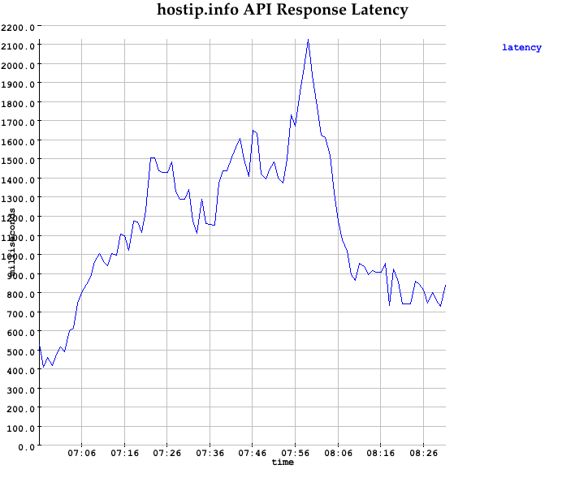
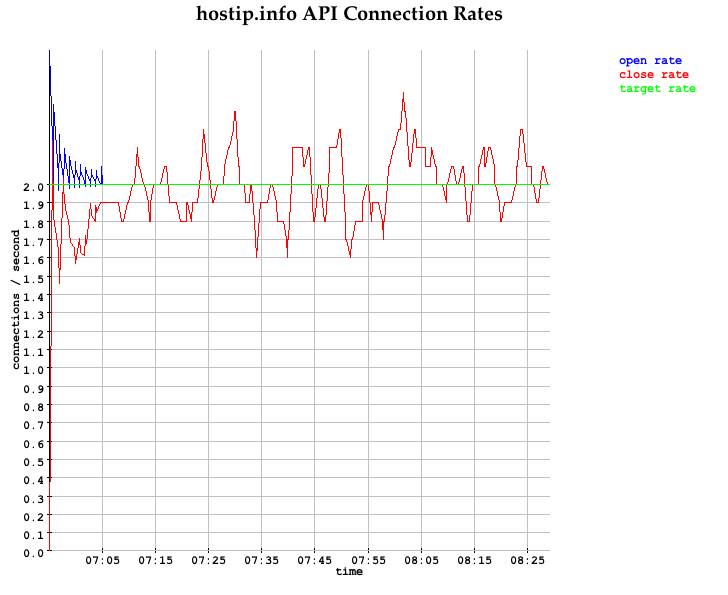

hammer
======

Also see Demo.scala.

The Hammer class requires a LoadGenerator.

The following load generator uses
[Dispatch](http://dispatch.databinder.net/Dispatch.html) library
to make asynchronous HTTP requests.

```scala

import org.pingel.hammer._
import dispatch._ // , Defaults._
import scala.concurrent.ExecutionContext.Implicits.global
import util.Random.nextInt

class HostIpApiLoadGenerator extends LoadGenerator {

  def name() = "hostip.info API"

  val requestBuilders = Vector(
    url("http://api.hostip.info/get_json.php"),
    url("http://api.hostip.info/country.php")
  )

  def randomRequestBuilder() = requestBuilders(nextInt(requestBuilders.size))

  def makeNextRequest(id: Long) = {
    Http(randomRequestBuilder() OK as.String)
  }
}
```

Start the load generator, issuing 2 requests per second (2 Hz):

```scala
import axle.quanta._
import Frequency._

val hammer = new Hammer(new HostIpApiLoadGenerator(), 2 *: Hz)
```

Log hammer statistics every 5 seconds with:

```scala
import Time._
hammer.logStatsEvery(5 *: second)
```

Example output:

```
[INFO] [04/29/2013 01:03:17.175] [HammerSystem-akka.actor.default-dispatcher-3] [akka://HammerSystem/user/$a] 
Hammer statistics

  Current time: 1367222597174
  Target RPS: 2 Hz
  Average # requests started per second: 2.0 Hz
  Average # requests completed per second: 2.0 Hz
  Latency average: 916.55 ms
  Current # pending requests: 2
  Total # requests: 60
```

To repeat this output, clone this repository and do `sbt run`.

Set the target requests/second after the hammer is running:

```scala
hammer.rps(0.2 *: Hz)
```

Create a plots for

* latency average
* target rate as well as the connections opened and closed rate

```scala
import axle.visualize._
import axle.algebra.Plottable._

implicit val msP = ms.plottable
show(hammer.latencyPlot())

implicit val hzP = Hz.plottable
show(hammer.connectionRatePlot())
```





