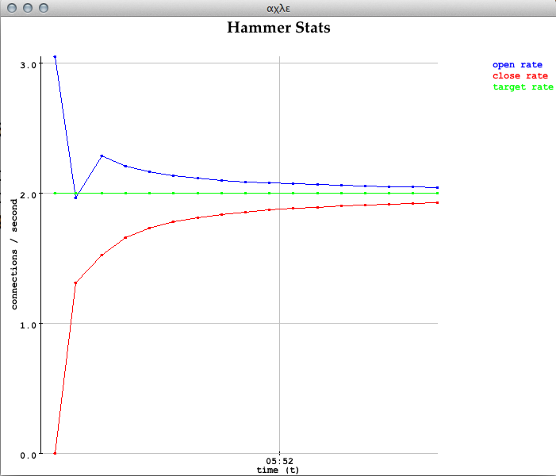

hammer
======

Also see Demo.scala.

The Hammer class requires a LoadGenerator.

The following load generator uses
[Dispatch](http://dispatch.databinder.net/Dispatch.html) library
to make asynchronous HTTP requests.

```scala

import org.pingel.hammer._
import dispatch._ // , Defaults._
import scala.concurrent.ExecutionContext.Implicits.global
import util.Random.nextInt

class HostIpApiLoadGenerator extends LoadGenerator {

  val requestBuilders = Vector(
    url("http://api.hostip.info/get_json.php"),
    url("http://api.hostip.info/country.php")
  )

  def randomRequestBuilder() = requestBuilders(nextInt(requestBuilders.size))

  def makeNextRequest(id: Long) = {
    Http(randomRequestBuilder() OK as.String)
  }
}
```

Now start the load generator, issuing 2 reqeusts per second:

```scala
val hammer = new Hammer(new HostIpApiLoadGenerator(), 2d)
```

Log connection open/closed rates every 5 seconds with:

```scala
import scala.concurrent.duration._
hammer.logStats(5.seconds)
```

Example output:

```
[...]
[INFO] [04/22/2013 01:49:14.713] [HammerSystem-akka.actor.default-dispatcher-2] [akka://HammerSystem/user/$a] request 19 completed after 102 milliseconds
[INFO] [04/22/2013 01:49:15.615] [HammerSystem-akka.actor.default-dispatcher-3] [akka://HammerSystem/user/$a] 
Hammer statistics

  Current time: 1366620555612
  Target RPS: 1.0
  Average # requests started per second: 1.0470160043874956
  Average # requests completed per second: 0.9971580994166626
  Total # requests: 21
```

To repeat this output, clone this repository and do `sbt run`.

Set the target requests/second after the hammer is running:

```scala
hammer.rps(0.2)
```

To create a plot of the target rate as well as the connections
opened and closed rate, do this:

```scala
import axle.visualize._
show(hammer.connectionRatePlot)
show(hammer.latencyPlot)
```



